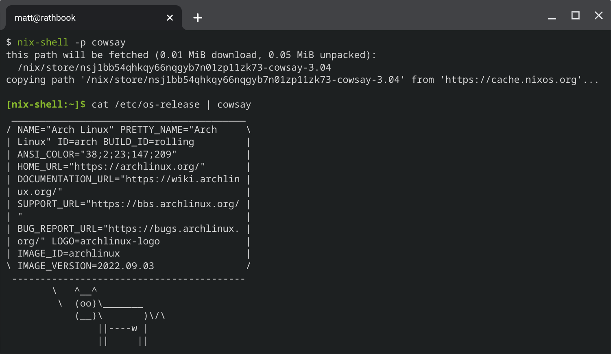

Hi, I'm Matt and I'm one of those masochists who uses a chromebook as their personal development machine (not work though, I'm not _that_ crazy). A cool thing about Chrome OS's Linux support is that you can swap the default, *boring* Debian container for any LXC image. [Here's an archwiki page on how to swap it to Arch!](https://wiki.archlinux.org/title/Chrome_OS_devices/Crostini)

A not-so-cool thing about that LXC setup is that there isn't a NixOS LXC image available 😢. Instead, I set up an Arch Linux container with Nix and Home Manager. Best of both worlds I guess? Here's how to do it.

<!--more-->

# What we're setting up

In these instructions, I'll be setting up `nix` and `home-manager`. This setup doesn't let you configure system-level things in nix like in NixOS, but you _can_ configure things for your user using `home-manager`. If you set up [nix-direnv](https://github.com/nix-community/nix-direnv) in your home-manager config, you can add nix configurations for specific directories.

This should work for any Arch Linux install, not just my weird LXC image.

# Let's go!

1. Install nix

    ```shell
    sudo pacman -S nix
    ```

2. Enable and start `nix-daemon`

    ```shell
    sudo systemctl enable nix-daemon
    sudo systemctl start nix-daemon
    ```

3. Add your user to the `nix-users` group

    ```shell
    sudo gpasswd -a <user> nix-users
    ```

4. Log out and back in again for the group change to take effect

5. Add `nixpkgs` and `home-manager` channels

    ```shell
    nix-channel --add https://nixos.org/channels/nixpkgs-unstable
    nix-channel --add https://github.com/nix-community/home-manager/archive/master.tar.gz home-manager
    nix-channel --update
    ```

7. Install home-manager

    ```shell
    export NIX_PATH=$HOME/.nix-defexpr/channels:/nix/var/nix/profiles/per-user/root/channels${NIX_PATH:+:$NIX_PATH}
    nix-shell '<home-manager>' -A install
    ```

8. Take a look at `~/.config/nixpkgs/home.nix`, make any desired changes, then run

    ```shell
    home-manager switch
    ```

And that should be it! Enjoy!



# For more info...

These instructions are basically a condensed version of these two pages:

* [Nix - ArchWiki](https://wiki.archlinux.org/title/Nix)
* [Home Manager standalone installation](https://nix-community.github.io/home-manager/index.html#sec-install-standalone)
