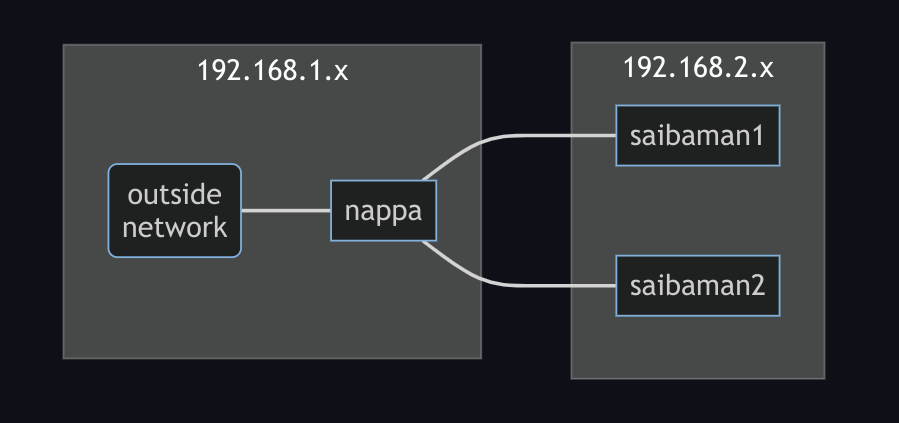

It's been almost two years since I built my [first k3s raspberry pi cluster](/posts/rpi-k3s-cluster). A lot's changed! There's a new node in the cluster and I've gone off the deep end switching everything to NixOS. In this post, I'll talk about the new node and some of the nix options that enable it.

<!--more-->

# Nappa... the Control Plane?

The new addition to the cluster is `nappa`, an x86 NUC that now runs the control plane. Its extra processing power fixes the stability issues I had when the cluster was all Raspberry Pis. It also serves as network gateway (it has two ethernet ports!) and NFS server (for persistent volume storage) for the rest of the cluster. The new diagram looks like this:



Ok and I also splurged on some new Raspberry Pis. `saibaman1` and `saibaman2` are now Raspberry Pi 4s with 8GB of memory.

# Setting up a network gateway in NixOS

`nappa` runs NixOS, which makes it really simple to set up [dnsmasq](https://thekelleys.org.uk/dnsmasq/doc.html). In the config below, I set up a subnet at 192.168.2.x, but only on the ethernet port connected to the Raspberry Pis:

```nix
services.dnsmasq = {
  enable = true;
  extraConfig = ''
    interface=enp4s0
    dhcp-range=192.168.2.10,192.168.2.250,255.255.255.0,12h
  '';
};
```

Next, I set up an iptables rule to allow the Raspberry Pis to reach out to the outside world. The contents of the `networking.firewall.extraCommands` option below are what do this:

```nix
networking.firewall = {
  enable = true;
  extraCommands = ''
    iptables -t nat -A POSTROUTING -o eno1 -j MASQUERADE
  '';
  trustedInterfaces = [ "eno1" "enp4s0" ];
  allowedTCPPortRanges = [{ from = 1; to = 65535; }];
  allowedUDPPortRanges = [{ from = 1; to = 65535; }];
};
```

This configuration is a little wacky. The firewall is enabled because it's a requirement for iptables, but I open all of the ports so I don't have to worry about it blocking anything I'm working on.

# k3s in NixOS

With the networking up and running, we can set up k3s. This is another simple NixOS config option:

```nix
services.k3s = {
  enable = true;
  role = "server";
  extraFlags = "--advertise-address=192.168.2.1 --node-ip=192.168.2.1 --node-external-ip=192.168.1.4 --flannel-backend=host-gw --flannel-iface=enp4s0";
};
```

Phew, that's a lot of `extraFlags`. They're all needed due to `nappa`'s weird network setup. Note that k3s has flannel built in. NixOS's `service.flannel` option won't do anything here. Speaking of which...

## Flannel F-ups

After first setting up this cluster, everything seemed fine but there was some sort of networking issue. HTTP requests sent to services backed by pods running on Raspberry Pi nodes would time out but they'd be fine if the pods were running on `nappa`. I initially pointed the blame at the Raspberry Pis, poring through logs and configuration to try to figure out what was happening. But the problem was actually with `nappa`, which needed an additional flannel option passed to k3s:

```shell
--flannel-iface=enp4s0
```

That tells flannel to use the same ethernet port that the Raspberry Pis are connected to. All better!

# That's it for now!

The full configuration for `nappa` (and the rest of the cluster) can be found [here](https://github.com/mattbun/nappa). In my next post, I'll go through the changes I've made to the Raspberry Pis. Spoiler alert: they're also on NixOS!
